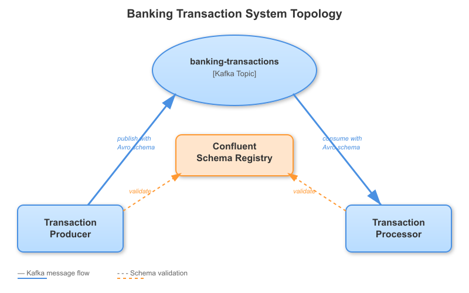

# Banking Transaction System

[](https://github.com/ballerina-platform/module-ballerinax-kafka)

_Authors_: @gayaldassanayake  
_Reviewers_: @ayeshLK  
_Created_: 2025/10/25  
_Updated_: 2025/10/25

## Overview
This use case demonstrates a real-time banking transaction processing system with schema validation using Kafka and Confluent Schema Registry. The system ensures data integrity and prevents invalid transactions from entering the pipeline through Avro schema validation.

This consists of 2 services:

- **Transaction Producer** - Simulates a banking application that creates various types of transactions (deposits, withdrawals, and transfers) and publishes them to a Kafka topic with Avro schema validation.
- **Transaction Processor** - A Kafka consumer service that listens to the transaction topic, validates business rules, processes transactions, and performs fraud detection on large withdrawals.

## Implementation



### Transaction Types Supported
1. **DEPOSIT** - Credit transactions to customer accounts
2. **WITHDRAWAL** - Debit transactions with fraud detection for large amounts (>$10,000)
3. **TRANSFER** - Fund transfers between accounts with recipient validation

### Schema Validation Features
- Amount must be a positive decimal (prevents string values like "one thousand")
- Transaction status must be one of: PENDING, COMPLETED, FAILED, CANCELLED
- Transaction type must be one of: DEPOSIT, WITHDRAWAL, TRANSFER
- Required fields validation (account_number, transaction_id, etc.)
- Transfer transactions must include recipient_account

## Prerequisites

#### Setting Up Confluent Cloud
1. [Create a Confluent Cloud account](https://confluent.cloud/)
2. Create a Kafka cluster
3. Enable Schema Registry in your environment
4. Create API keys for:
   - Kafka cluster access
   - Schema Registry access
5. Create a topic named `banking-transactions`

#### Alternative: Local Setup
1. [Install Kafka in your local machine](https://kafka.apache.org/downloads)
2. [Install Confluent Schema Registry](https://docs.confluent.io/platform/current/schema-registry/installation/index.html)
3. [Use Kafka with docker](https://hub.docker.com/r/confluentinc/cp-kafka/)

## Configuration

### Producer Configuration

Create a `Config.toml` file in the `producer` directory with your credentials:

```toml
# Kafka Configuration
bootstrapServers = "pkc-xxxxx.us-west-2.aws.confluent.cloud:9092"
kafkaAPIKey = "<YOUR_KAFKA_API_KEY>"
kafkaAPISecret = "<YOUR_KAFKA_API_SECRET>"
topicName = "banking-transactions"

# Schema Registry Configuration
baseUrl = "https://psrc-xxxxx.us-west-2.aws.confluent.cloud"
registryAPIKey = "<YOUR_SCHEMA_REGISTRY_API_KEY>"
registryAPISecret = "<YOUR_SCHEMA_REGISTRY_API_SECRET>"
identityMapCapacity = 100
```

### Processor Configuration

Create a `Config.toml` file in the `processor` directory with your credentials:

```toml
# Kafka Configuration
bootstrapServers = "pkc-xxxxx.us-west-2.aws.confluent.cloud:9092"
kafkaAPIKey = "<YOUR_KAFKA_API_KEY>"
kafkaAPISecret = "<YOUR_KAFKA_API_SECRET>"
topicName = "banking-transactions"
groupId = "transaction-processor-group"

# Schema Registry Configuration
baseUrl = "https://psrc-xxxxx.us-west-2.aws.confluent.cloud"
registryAPIKey = "<YOUR_SCHEMA_REGISTRY_API_KEY>"
registryAPISecret = "<YOUR_SCHEMA_REGISTRY_API_SECRET>"
```

## Run the Example

First, clone this repository, and then run the following commands in the given order to run this example in your local machine. Use separate terminals for each step.

1. Run the Transaction Processor (Consumer).
```sh
$ cd examples/banking-transaction-system/processor
$ bal run
```

2. Run the Transaction Producer in a separate terminal.
```sh
$ cd examples/banking-transaction-system/producer
$ bal run
```

## Expected Output

### Producer Output
```
🏦 Banking Transaction Producer Started
=====================================

📥 Scenario 1: Processing DEPOSIT transaction...
  ✓ Transaction ID: 550e8400-e29b-41d4-a716-446655440000
  ✓ Type: DEPOSIT
  ✓ Amount: 5000.00 USD
  ✓ Account: ACC-123456
  ✓ Schema validated and sent to Kafka

💸 Scenario 2: Processing WITHDRAWAL transaction...
  ✓ Transaction ID: 550e8400-e29b-41d4-a716-446655440001
  ✓ Type: WITHDRAWAL
  ✓ Amount: 200.50 USD
  ✓ Account: ACC-123456
  ✓ Schema validated and sent to Kafka

🔄 Scenario 3: Processing TRANSFER transaction...
  ✓ Transaction ID: 550e8400-e29b-41d4-a716-446655440002
  ✓ Type: TRANSFER
  ✓ Amount: 1500.0 USD
  ✓ Account: ACC-123456
  ✓ Recipient: ACC-789012

🚨 Scenario 4: Processing LARGE WITHDRAWAL (potential fraud alert)...
  ✓ Transaction ID: 550e8400-e29b-41d4-a716-446655440003
  ✓ Type: WITHDRAWAL
  ✓ Amount: 15000.00 USD
  ✓ Account: ACC-123456
  ✓ Schema validated and sent to Kafka

✅ All transactions sent successfully!
Schema was validated for each transaction before sending.

🔒 Producer closed.
```

### Consumer Output
```
============================================================
🏦 PROCESSING TRANSACTION
============================================================
Transaction ID: 550e8400-e29b-41d4-a716-446655440000
Account: ACC-123456
Type: DEPOSIT
Amount: 5000.00 USD
Status: PENDING
Timestamp: 2025-10-25T12:30:00Z
Description: Salary deposit
  💰 Processing deposit of 5000.00 USD
  ✓ Account ACC-123456 credited
  📝 Transaction logged for compliance (ID: 550e8400-e29b-41d4-a716-446655440000)
✅ TRANSACTION PROCESSED SUCCESSFULLY
============================================================

============================================================
🏦 PROCESSING TRANSACTION
============================================================
Transaction ID: 550e8400-e29b-41d4-a716-446655440003
Account: ACC-123456
Type: WITHDRAWAL
Amount: 15000.00 USD
Status: PENDING
Timestamp: 2025-10-25T12:30:45Z
Description: Large cash withdrawal
  💸 Processing withdrawal of 15000.00 USD
  ⚠️  ALERT: Large withdrawal detected (15000.00 USD)
  📧 Notification sent to account holder
  ✓ Account ACC-123456 debited
  📝 Transaction logged for compliance (ID: 550e8400-e29b-41d4-a716-446655440003)
✅ TRANSACTION PROCESSED SUCCESSFULLY
============================================================
```

## Schema Validation in Action

### Valid Transaction ✅
```ballerina
Transaction valid = {
    transaction_id: "TXN-001",
    account_number: "ACC-123456",
    transaction_type: DEPOSIT,
    amount: 1000.00,  // Correct decimal type
    currency: "USD",
    timestamp: "2025-10-25T12:00:00Z",
    status: PENDING,
    description: "Valid deposit",
    recipient_account: ()
};
// ✅ Schema validation passes, message sent successfully
```

### Invalid Transaction ❌
```ballerina
// This example shows what schema validation prevents
record {
    string transaction_id;
    string account_number;
    string transaction_type;
    string amount;  // ❌ Wrong type! Should be decimal
    string currency;
} invalid = {
    transaction_id: "TXN-002",
    account_number: "ACC-123456",
    transaction_type: "DEPOSIT",
    amount: "one thousand",  // ❌ Schema rejects this
    currency: "USD"
};
// ❌ Schema validation fails at producer serialization
// Error: Cannot serialize - amount must be decimal type
```

## Key Features Demonstrated

1. **Producer-Side Validation**
   - Schema validation before sending to Kafka
   - Prevents invalid data from entering the system
   - Schema is automatically registered with Schema Registry when sending messages

2. **Consumer-Side Processing**
   - Strongly-typed transaction records
   - Business rule validation (positive amounts, account format)
   - Fraud detection for large withdrawals (>$10,000)
   - Compliance logging

3. **Schema Evolution Support**
   - Can upgrade to TransactionV2 with fraud detection fields
   - Old consumers continue working (backward compatibility)
   - New consumers can read old messages (forward compatibility)

## Benefits of Schema Registry

- ✅ **Data Quality** - Invalid transactions are rejected before reaching Kafka
- ✅ **Type Safety** - Ensures amounts are decimals, not strings
- ✅ **Evolution** - Add new fields without breaking existing consumers
- ✅ **Documentation** - Schema serves as contract between services
- ✅ **Compliance** - Critical for financial data integrity and auditing

## Troubleshooting

### Error: 401 Unauthorized (Schema Registry)
- Verify Schema Registry API credentials are correct
- Ensure credentials are for Schema Registry, not Kafka cluster

### Error: 40403 Schema Not Found
- Run the producer first to send at least one message (schema is auto-registered on first send)
- Verify topic name matches in both producer and consumer
- Ensure Schema Registry configuration is correct in both services

### Error: Connection Refused
- Ensure Kafka bootstrap server URL is correct
- Check security protocol is set to SASL_SSL for Confluent Cloud
- Verify API keys have proper permissions

## Learn More

- [Ballerina Kafka Module Documentation](https://central.ballerina.io/ballerinax/kafka/latest)
- [Confluent Schema Registry Documentation](https://docs.confluent.io/platform/current/schema-registry/index.html)
- [Apache Avro Documentation](https://avro.apache.org/docs/current/)
