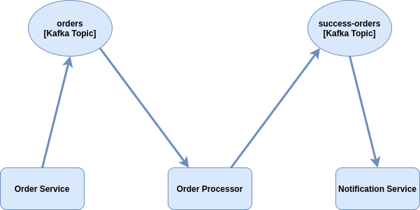

# Order Manager

[](https://github.com/ballerina-platform/module-ballerinax-kafka)

_Authors_: @shafreenAnfar @dilanSachi  
_Reviewers_: @shafreenAnfar  
_Created_: 2021/09/10  
_Updated_: 2023/04/18

## Overview
This usecase is inspired by the [How Kafka Can Make Microservice Planet a Better Place](https://dzone.com/articles/how-kafka-can-make-microservice-planet-better) article.
This consists of 3 services.

- **Order Service** - An Http service with a Kafka producer which publishes an order to a Kafka topic when a request is received.
- **Order Processor** - A Kafka listener which listens to the Kafka topic and validates the order. If the order is successful, it is published to a new topic by a Kafka producer.
- **Notification Service** - A Kafka listener which listens to the successful orders and mocks sending a notification.

## Implementation



#### Setting Up Kafka
1. [Install Kafka in your local machine](https://kafka.apache.org/downloads)
2. [Use Kafka with docker](https://hub.docker.com/r/confluentinc/cp-kafka/)

## Run the Example

First, clone this repository, and then, run the following commands in the given order to run this example in your local machine. Use separate terminals for each step.

1. Run the Order Service.
```sh
$ cd examples/order-manager/order-service
$ bal run
```
2. Run the Order processor.
```sh
$ cd examples/order-manager/order-processor
$ bal run
```
3. Run the Notification service.
```sh
$ cd examples/order-manager/notification-service
$ bal run
```
4. Send a request to the order service with order details using `curl`.
```
curl -X GET "http://localhost:9090/kafka/publish?message=PS5&status=SUCCESS" -u user:password
```
