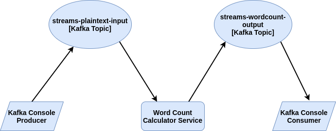

# Secured Word Count Calculator

## Overview
This usecase is inspired by the [Word Count Lambda](https://github.com/confluentinc/kafka-streams-examples/blob/7.0.0-post/src/main/java/io/confluent/examples/streams/WordCountLambdaExample.java) example.
In this example, Kafka listener reads from a topic named `streams-plaintext-input`, where the values of messages represent lines of text. This text is processed and the word counts are calculated and the histogram output is written to topic `streams-wordcount-output`.
The difference in this example is that, we use a secured kafka cluster and communicate with the cluster via secure producers and consumers.

## Implementation



#### Setting Up Kafka
1. [Install Kafka in your local machine](https://kafka.apache.org/downloads)
2. [Use Kafka with docker](https://hub.docker.com/r/confluentinc/cp-kafka/)

* You can refer [here](https://docs.confluent.io/platform/current/kafka/authentication_ssl.html) to learn how to deploy a secured Kafka cluster.
* You can find the docker file used to set up the cluster for this example in [here](../../ballerina/tests/docker-compose.yaml).

## Run the Example

First, clone this repository, and then, run the following commands in the given order to run this example in your local machine. Use separate terminals for each step.

1. Start the Word Count Calculator Service.
```sh
$ cd examples/secured_word_count_calculator/word_count_calculator
$ bal run
```
2. Start a console consumer to view the word counts.
   Please note that you have to have a Kafka installation in order to use the `console-consumer` and `console-producer`.
```sh
$ kafka_installation/bin/kafka-console-consumer.sh --topic streams-wordcount-output --from-beginning --bootstrap-server localhost:9092 --property print.key=true
```
3. Start a console producer to publish sentences.
```sh
$ kafka_installation/bin/kafka-console-producer.sh --broker-list localhost:9092 --topic streams-plaintext-input
```
You can then enter input data by writing some line of text, followed by ENTER.
```
Hello World<ENTER>
Hello Ballerina<ENTER>
Hello Kafka<ENTER>
```
You will be able to see the counts displayed in the console as follows.
```
Hello 1
World 1
Hello 2
Ballerina 1
Hello 3
Kafka 1
```
